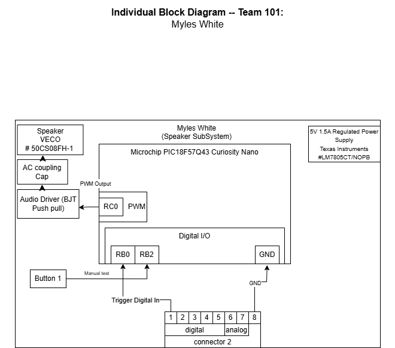

## Overview
(Speaker/Alert Board) Generates audio Feedback when button or potentiometer state is changed. 

The power supply and voltage regulator provides a 5V source for all electronics. The partner control input and manual test button allow both system level triggering andlocal testig of the speaker subsyste,. The PIC microcontroller proceses these inputs and generates a PWM signal used to create an audible tone. The push pull amplifier increases the signal strength to drive the speaker, while the coupling capacitor removes DC offset for clean audio output. Status LED provide visual confirmation of system activity.Together, these blocks ensure realible real time audible feedback, independent testing capability and safe operation within system limits. 

