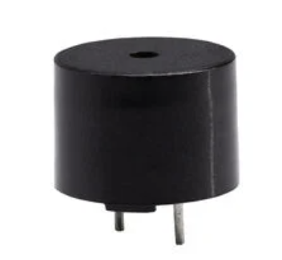
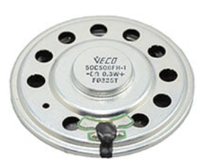

**Speaker Comparison**

1. CMT-1209-590T Buzzer 

    

    * $1.54/each
    * [link to product](http://www.digikey.com/product-detail/en/ECS-40.3-S-5PX-TR/XC1259TR-ND/827366)

    | Pros                                      | Cons                                                             |
    | ----------------------------------------- | ---------------------------------------------------------------- |
    | Loud Output (90 dB)                              | One tone |
    | Through Hole mount                     | Fixed resonant frequency                                        |
    | Simple PWM drive |

1. VECO 50CS08FH-1 Speaker

    

    * $0.59/each
    * [link to product](https://www.jameco.com/z/50CS08FH-1-Vansonic-Round-Ferrite-Speaker-1-94-Diameter-8-ohm-0-4-Watt-200-Hz-to-5-kHz_2328575.html?srsltid=AfmBOorK3V0Fo3Cn0z_fcK4U6CxbM_HthdVQznWuKYyMYo8L2BXqjeSr)
  
      

    | Pros                                                              | Cons                |
    | ----------------------------------------------------------------- | ------------------- |
    | Low Cost                                             | Pretty Quiet (85dB)      |
    | Low Power Use                                 | limited tone range |
    | Through hole mount |

**Choice:** Option 1:VECO 50CS08FH-1 Speaker

**Rationale:** The VECO 50CS08FH-1 provides a easy to integrate solution for the outdoor temprature alert sound syestem. It can be used directly by the micro controllers PWM signal with a op amp and transitstor. With it being through hole mount and solid sound with out requiring a dedicated audio driver. The alternative is too quiet for realistic outdoor use. 

**Voltage Regulator Comparison**

1. Ti LM7805 5V Linear Regulator 

    * $0.88/each
    * [link to product](https://www.digikey.com/en/products/detail/texas-instruments/LM7805CT-NOPB/3901929?gclsrc=aw.ds&gad_source=1&gad_campaignid=17338792030&gbraid=0AAAAADrbLlgD06YuCRRbNvrHtvYd-5puf&gclid=Cj0KCQiAi9rJBhCYARIsALyPDtsrAECxK8bvDTH6ygL4ncxuzGbe1dcxQVmGJbaXaqGTxQ_9gyD9MuAaAktPEALw_wcB)

    | Pros                                      | Cons                                                             |
    | ----------------------------------------- | ---------------------------------------------------------------- |
    | Simple Design                             |Waste power as heat|
    | Provides up to 1A with proper heat sinking                  | Requires basic thermal consideration if current ever gets too high                                      |
    | Widley available local stock  |

1. Ti LM2596 DC-DC Buck Converter Module 5V

   

    * $3.08/each
    * [Link to product](https://www.digikey.com/en/products/detail/texas-instruments/LM2596T-ADJ-NOPB/363709)

    | Pros                                                              | Cons                |
    | ----------------------------------------------------------------- | ------------------- |
    | Very Efficient                                         | More complex behavior    |
    | much less heat disapation for the same amount of current                            | Physically larger|
    |  |

**Choice:** Ti LM7805
**Rationale:** The LM7805 is very simple to implement on a PCB, a TO-220 through hole footprint makes it easy for soldiering and debugging. The lower electrical noise of a linear regulator is helpful for a cleaner audio signal into the speaker amplifier stage. For these reasons the LM7805 is a great choice for a 5V source to power all the loads on the board. 

## Major Components Summary

| Component | Part Number / Module | Function in System | Key Specs |  |
|----------|----------------------|--------------------|-----------|----------------|
| **Microcontroller Board** | Microchip **PIC18F57Q43 Curiosity Nano** | Reads partner digital signal, reads manual test button, generates PWM/audio output | 64 MHz internal oscillator, multiple GPIO, PWM output on RC0 |  |
| **Voltage Regulator** | **LM7805** (Linear 5 V Regulator) | Converts 9 V supply to stable 5 V rail for MCU & speaker circuit | Input: 7–35 V, Output: 5 V @ up to 1–1.5 A, thermal protection |  |
| **Speaker Driver Transistors** | NPN/PNP **Push Pull Pair** | Amplifies PWM output to drive the speaker with sufficient current | Handles audio frequency switching & moderate current |  |
| **Speaker** | 8 Ω small audio transducer | Converts PWM signal into audible beep | Typical 0.5W–1W, 8 Ω impedance | |
| **Partner Subsystem Output** | GPIO line from Raj’s MCU | Provides digital event trigger to the speaker subsystem | Logic level 5 V digital output |  |
