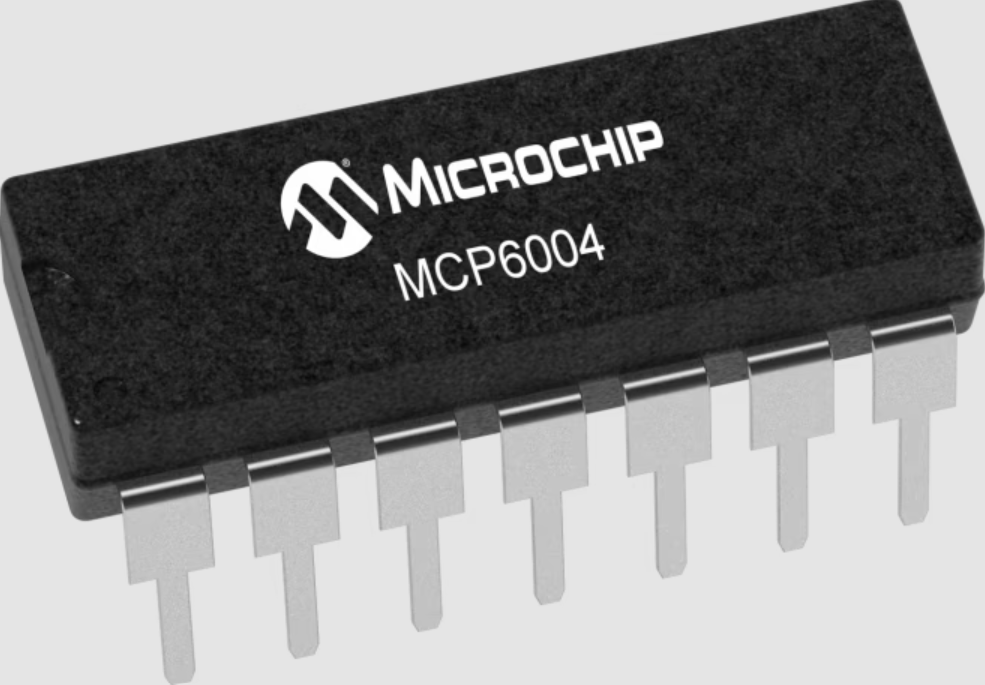
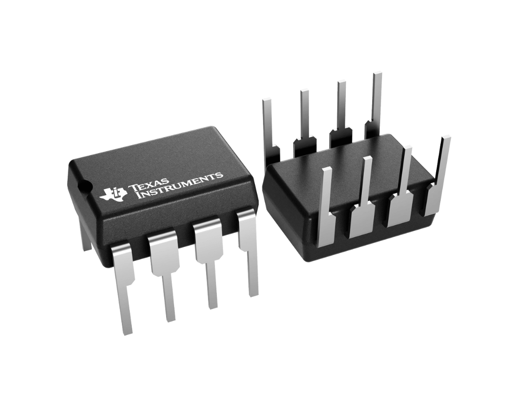

**Speaker Comparison**

1. CMT-1209-590T Buzzer 

    

    * $1.54/each
    * [link to product](http://www.digikey.com/product-detail/en/ECS-40.3-S-5PX-TR/XC1259TR-ND/827366)

    | Pros                                      | Cons                                                             |
    | ----------------------------------------- | ---------------------------------------------------------------- |
    | Loud Output (90 dB)                              | One tone |
    | Through Hole mount                     | Fixed resonant frequency                                        |
    | Simple PWM drive |

1. VECO 50CS08FH-1 Buzzer

    

    * $0.59/each
    * [Link to product]([http://www.digikey.com/product-detail/en/636L3I001M84320/CTX936TR-ND/2292940](https://www.endrich.com/Datenbl%C3%A4tter/Generalimport/672158.pdf?utm_source))

    | Pros                                                              | Cons                |
    | ----------------------------------------------------------------- | ------------------- |
    | Low Cost                                             | Pretty Quiet (85dB)      |
    | Low Power Use                                 | limited tone range |
    | Through hole mount |

**Choice:** Option 2: CTX936TR-ND surface mount oscillator

**Rationale:** The CMT 1209-590T provides a easy to integrate solution for the outdoor temprature alert sound syestem. It can be used directly by th e micro controllers PWM signal with a op amp and transitstor. Wit it beinf through hole mount and solid sound with out requiring a dedicated audio driver. The alternative is too quiet  for realistic outdoor use. 

**Op Amp Comparison**

1. Microchip MCP6004

    

    * $0.67/each
    * [link to product](http://www.digikey.com/product-detail/en/ECS-40.3-S-5PX-TR/XC1259TR-ND/827366)

    | Pros                                      | Cons                                                             |
    | ----------------------------------------- | ---------------------------------------------------------------- |
    | has a Dip 14 package                              |Limited current drive|
    | Easy for 5V systems                   | low Bandwith (1 MHz)                                        |
    | Has Rail to Rail Input and Output |

1. Ti LM358

    

    * $0.27/each
    * [Link to product]([[http://www.digikey.com/product-detail/en/636L3I001M84320/CTX936TR-ND/2292940](https://www.endrich.com/Datenbl%C3%A4tter/Generalimport/672158.pdf?utm_source)](https://www.ti.com/product/LM358#tech-docs))

    | Pros                                                              | Cons                |
    | ----------------------------------------------------------------- | ------------------- |
    | Really cheap and Available                                           | Only handles 3.5V     |
    | good for low frequency analog systems                                | Higher offset voltage|
    |  |

**Choice:** Microchip MCP6004
**Rationale:** The MCP6004 is made for 5V systems such as our Curisosity Nano. Its consumes low power and comes with the Dip-14 package. The alternitive was better in cost but lacks accepting 5V. The MCP is not complex and will be easy to integrate into our system. 
