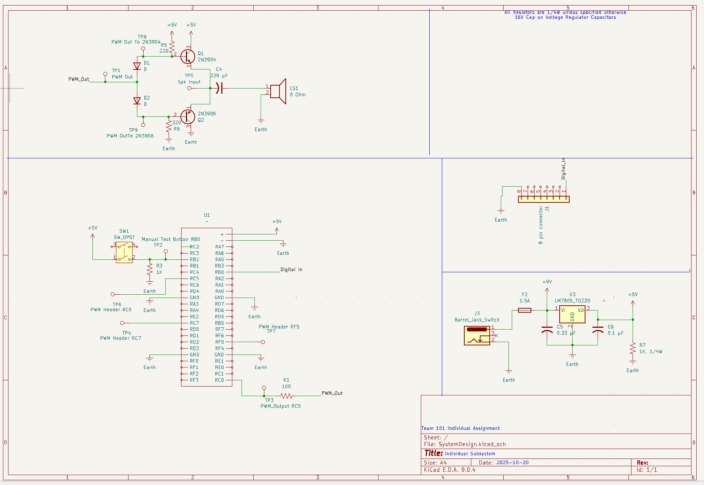

## Overview

This schematic is the subsystem that creates audio feedback from the Micro controller using a PWM to audio chain. A PWM signial is filtered and level biased then buffered by a Op Amp referenced to a mid rail Vref = VDD/2, R3/R4 with C1. Power is provided by a 9V 3A wall adapter feeding a custom 5V regulator that creates the VDD=5V. Test points are included on VDD, GND, RA2(PWM), VOUTA, and to the lead 1 of the speaker to help troubleshooting 

{style width:"350" height:"300;"}
**Figure ##:** 
{style width:"350" height:"300;"}
**Figure ##:** 

## Resouces

The schematic as a PDF download is available [*here*](SchematicFinal1.pdf)
