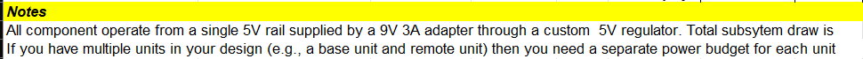

## Overview
 Created this Power Budget to anaylze and verify the power requirements of my speaker subsystem within the Sprinkler project. The goal was to ensure that all components I am ising operate safely and effcieently from a shared 5V rail. By getting the calculated current draw and adding a 25% saftey margin and confirming the compatibility with the external power supply with the voltage regulator, and it will demonstrate that the system can provide suffecient current to all active components without overrloading the supply. 

> Capture your power budge as a image to display. Take time to get clean breaks and a well organized layout.

![budget1]
{style width:"350" height:"300;"}

![budget2]{
style width:"350" height:"300;"}

![budget3]
{style width:"350" height:"300;"}

{style width:"350" height:"300;"}

## Conclusions

Preparing the power budget gave me a clear understand of how each device in the system will consume power. This proccess showed that the 5V power rail and chosen components meet operational requirements. This ensures a reliable and stable power design for the speaker subsystem. 

The Power budget allowed me to estimate the total current needed for the speaker subsystem and confirm that alll components remain within the limits of the 5V regulator. By adding the expected current for the microcontroller and the push pull amplifier, we verified that the system stays safely below the regulators max output. This ensured the design would operate reliably eithout over heating and helped validate that our component choices meet the projects requirements.

## Resouces

The power budget as a PDF download is available [*here*](PowerBudgetIndividual.pdf), and a Microsoft Excel Sheet [*here*](PowerBudgetindiv.xlsx).
